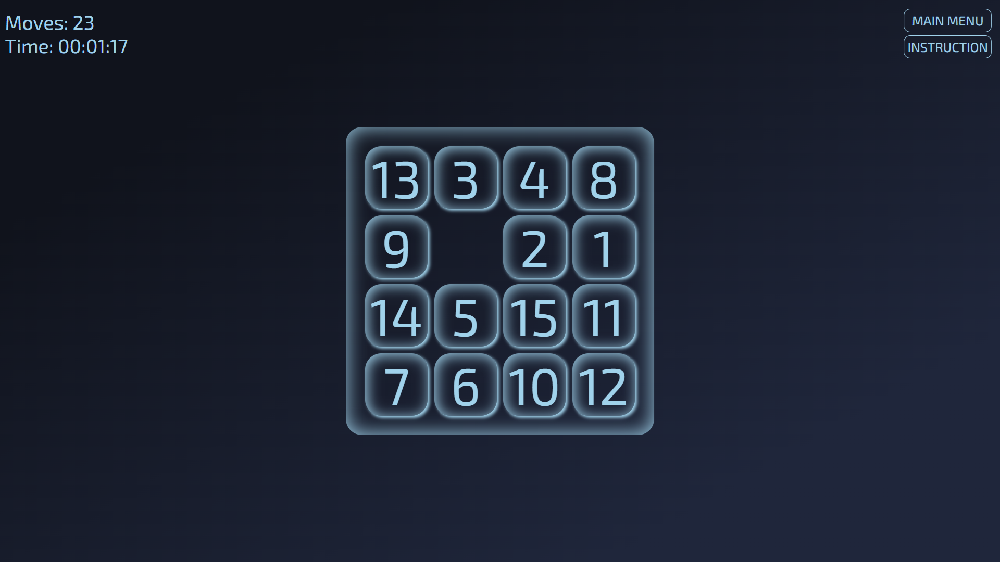
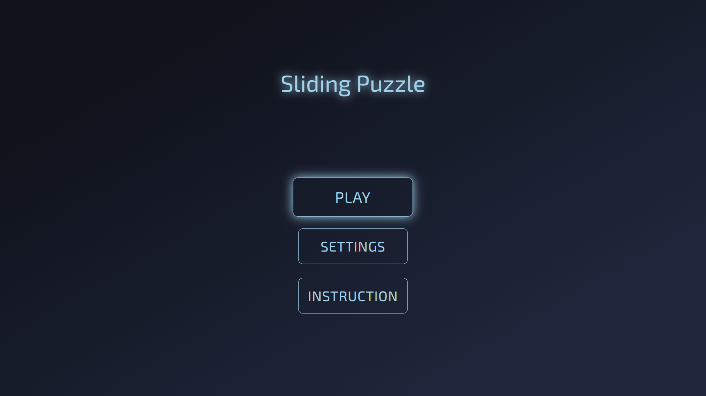

# SLIDING PUZZLE



This game is based on the old mechanical puzzle called 15 Puzzle. It is created with HTML, CSS and JavaScript, by using Visual Studio Code as the code editor.

## Table of Contents

- [Deployed Game](#deployed-game)
- [Installation](#installation)
- [Game Description](#game-description)
  - [Main Menu](#main-menu)
  - [Game Screen](#game-screen)
  - [Settings](#settings)
  - [Instruction](#instruction)
- [Code Explanation](#code-explanation)
  - [Global Variable](#global-variable)
  - [Cached Element References](#cached-element-references)
  - [Play Button](#play-button)
    - [Start Loading](#start-loading)
    - [Create Cell](#create-cell)
    - [Shuffle](#shuffle)
    - [Start Timer](#start-timer)
  - [Game Main Logic](#game-main-logic)
    - [Move](#move)
    - [Check Win](#check-win)
  - [Reset Button](#reset-button)
    - [Reset Stat](#reset-stat)
    - [Remove Cell](#remove-cell)
  - [Settings Button](#settings-button)
  - [Instruction Button](#instruction-button)
- [Next Steps](#next-steps)
- [Attributions](#attributions)

## Deployed Game

Live URL: [Sliding Puzzle](https://kevinpramudyanto.github.io/sliding-puzzle/)

## Installation

1. Clone this repository: https://github.com/KevinPramudyanto/sliding-puzzle.git
2. Open `index.html` to start playing

## Game Description

This is a puzzle game that require player to slide tiles on a board. The objective is to place the tiles in ascending order, by using paths opened up by the empty tile.

### Main Menu



Upon landing, here is the list of buttons to choose for:

- Play : Begin a new game by opening the game screen
- Settings : Open options for adjusting board size and appearance
- Instruction : Brief explanation on how to play the game

### Game Screen


The primary interface where players interact with. It includes:

- Board : The main visual area where the action takes place
- Moves & Time : Displays current scores (moves, time) for record
- Main Menu Button : To reset the game, opening a menu for confirmation
- Instruction : Opening the instruction page, similar with main menu's instruction

On win, pop-up message will appear. The elements including:

- Record: Displaying total moves and total time
- Main Menu Button : Reset the game, and go back to main menu


### Settings


Here is what the player can customize:

- Board Size : Change row or column size (from 3x3 to 6x6)
- Appearance : Toggle between light mode or dark mode

Default Button to revert back to default options (4x4 board size). OK Button to save the changes and go back to main menu.

### Instruction


This page is explaining how to play the game. Click anywhere on the screen to go back to main menu.

## Code Explanation

### Global Variable

Defined at the beginning of the code, such as numbers of row, numbers of column, appearance, total moves, total time, board's cell.

```javascript
let row = 4;
let col = 4;
let light = false;
let moves = 0;
let timerInterval;
let cells = [];
```

### Cached Element References

Stored the elements in a variable, for DOM element that need to be accessed by the code later on.

```javascript
const mainMenuContainerEl = document.querySelector(".mainMenuContainer");
const playBtn = document.querySelector("#playBtn");
const settingBtn = document.querySelector("#settingBtn");
const instructionBtn = document.querySelector("#instructionBtn");

const loadingContainerEl = document.querySelector(".loadingContainer");
const loadingNumEl = document.querySelector("#loadingNum");
const loadingBarProgressEl = document.querySelector(".loadingBarProgress");

const gameContainerEl = document.querySelector(".gameContainer");
const movesEl = document.querySelector("#moves");
const timeEl = document.querySelector("#time");
const confirmResetBtn = document.querySelector("#confirmResetBtn");
const instruction2Btn = document.querySelector("#instruction2Btn");
const board = document.querySelector(".board");

const cnfrmResetContainerEl = document.querySelector(".cnfrmResetContainer");
const resetBtn = document.querySelector("#resetBtn");

const winContainerEl = document.querySelector(".winContainer");
const totalMovesEl = document.querySelector("#totalMoves");
const totalTimeEl = document.querySelector("#totalTime");
const reset2Btn = document.querySelector("#reset2Btn");

const settingContainerEl = document.querySelector(".settingContainer");
const rowButtons = document.querySelector(".rowButtons");
const row3Btn = document.querySelector("#row3Btn");
const row4Btn = document.querySelector("#row4Btn");
const row5Btn = document.querySelector("#row5Btn");
const row6Btn = document.querySelector("#row6Btn");
const colButtons = document.querySelector(".colButtons");
const col3Btn = document.querySelector("#col3Btn");
const col4Btn = document.querySelector("#col4Btn");
const col5Btn = document.querySelector("#col5Btn");
const col6Btn = document.querySelector("#col6Btn");
const lightButtons = document.querySelector(".lightButtons");
const okBtn = document.querySelector("#okBtn");
const defaultBtn = document.querySelector("#defaultBtn");

const instructionContainerEl = document.querySelector(".instructionContainer");
```

### Play Button

On click:

1. Display the loading page (`loadingContainerEl.style.display = "flex"`)
2. Run the loading animation (`startLoading` function)
3. Generate each tile on the board (`createCell` function)
4. Randomize the tiles configuration (`shuffle` function)
5. Display the game screen (`gameContainerEl.style.display = "flex"`)
6. Start the timer (`startTimer` function)

```javascript
playBtn.addEventListener("click", handlePlayBtnClick);
```

```javascript
const handlePlayBtnClick = () => {
  mainMenuContainerEl.style.display = "none";
  loadingContainerEl.style.display = "flex";
  gameContainerEl.style.display = "none";
  startLoading();
  createCell();
  shuffle();
  setTimeout(() => {
    mainMenuContainerEl.style.display = "none";
    loadingContainerEl.style.display = "none";
    gameContainerEl.style.display = "flex";
    startTimer();
  }, 2500);
};
```

#### Start Loading

Increment the percentage bar for every 20ms, and update the corresponding CSS. This is to simulate a loading animation (from 0% to 100%).

```javascript
const startLoading = () => {
  let percentage = 0;
  const loadingInterval = setInterval(() => {
    loadingNumEl.innerText = percentage + "%";
    loadingBarProgressEl.style.width = percentage + "%";
    percentage++;
    if (percentage > 100) {
      clearInterval(loadingInterval);
    }
  }, 20);
};
```

#### Create Cell

Create new element to represent each tile inside the board (e.g 4x4 board is consist of 16 child elements).

```javascript
const createCell = () => {
  board.style.gridTemplateRows = `repeat(${row}, 1fr)`;
  board.style.gridTemplateColumns = `repeat(${col}, 1fr)`;

  let num = 0;
  for (let i = 0; i < row; i++) {
    cells.push([]);
    for (let j = 0; j < col; j++) {
      const divEl = document.createElement("div");
      divEl.classList.add("cell");
      divEl.classList.add("full");
      divEl.id = `cell${i}${j}`;
      board.appendChild(divEl);

      cells[i].push(document.querySelector(`#cell${i}${j}`));
      num++;
      cells[i][j].innerText = num;
    }
  }

  cells[row - 1][col - 1].classList.remove("full");
  cells[row - 1][col - 1].innerText = "";
};
```

#### Shuffle

Randomize the position of each tiles.

```javascript
const shuffle = () => {
  for (let count = 0; count < row * row * col * col; count++) {
    const randRow = Math.floor(Math.random() * row);
    const randCol = Math.floor(Math.random() * col);
    move(randRow, randCol);
  }
  moves = 0;
  movesEl.innerText = moves;
};
```

#### Start Timer

Increment the time for every 1s, and display it in HH:MM:SS format.

```javascript
const startTimer = () => {
  let time = 0;
  timerInterval = setInterval(() => {
    time++;
    const seconds = Math.floor(time % 60);
    const ss = seconds > 9 ? seconds : "0" + seconds;
    const minutes = Math.floor((time % 3600) / 60);
    const mm = minutes > 9 ? minutes : "0" + minutes;
    const hours = Math.floor(time / 3600);
    const hh = hours > 9 ? hours : "0" + hours;
    timeEl.innerText = `${hh}:${mm}:${ss}`;
  }, 1000);
};
```

### Game Main Logic

On click of any of the tiles:

1. Move the tile to empty position if possible (`move` function)
2. Check whether it is the winning configuration (`checkWin` function)

```javascript
board.addEventListener("click", handleBoardClick);
```

```javascript
const handleBoardClick = (e) => {
  const currRow = parseInt(e.target.id.charAt(4));
  const currCol = parseInt(e.target.id.charAt(5));
  move(currRow, currCol);
  checkWin();
};
```

#### Move

1. Check whether the clicked tile is adjacent to the empty tile
2. If it is, swap the clicked tile with the empty tile
3. Update the corresponding CSS. This CSS is to simulate a sliding animation (from clicked tile position to empty tile position).

```javascript
const move = (r, c) => {
  if (c + 1 < col && cells[r][c + 1].innerText === "") {
    cells[r][c + 1].innerText = cells[r][c].innerText;
    cells[r][c].innerText = "";
    cells[r][c + 1].classList.toggle("full");
    cells[r][c + 1].classList.toggle("moveRight");
    setTimeout(() => cells[r][c + 1].classList.toggle("moveRight"), 500);
    cells[r][c].classList.toggle("full");
    moves++;
    movesEl.innerText = moves;
  } else if (c - 1 >= 0 && cells[r][c - 1].innerText === "") {
    cells[r][c - 1].innerText = cells[r][c].innerText;
    cells[r][c].innerText = "";
    cells[r][c - 1].classList.toggle("full");
    cells[r][c - 1].classList.toggle("moveLeft");
    setTimeout(() => cells[r][c - 1].classList.toggle("moveLeft"), 500);
    cells[r][c].classList.toggle("full");
    moves++;
    movesEl.innerText = moves;
  } else if (r + 1 < row && cells[r + 1][c].innerText === "") {
    cells[r + 1][c].innerText = cells[r][c].innerText;
    cells[r][c].innerText = "";
    cells[r + 1][c].classList.toggle("full");
    cells[r + 1][c].classList.toggle("moveDown");
    setTimeout(() => cells[r + 1][c].classList.toggle("moveDown"), 500);
    cells[r][c].classList.toggle("full");
    moves++;
    movesEl.innerText = moves;
  } else if (r - 1 >= 0 && cells[r - 1][c].innerText === "") {
    cells[r - 1][c].innerText = cells[r][c].innerText;
    cells[r][c].innerText = "";
    cells[r - 1][c].classList.toggle("full");
    cells[r - 1][c].classList.toggle("moveUp");
    setTimeout(() => cells[r - 1][c].classList.toggle("moveUp"), 500);
    cells[r][c].classList.toggle("full");
    moves++;
    movesEl.innerText = moves;
  }
};
```

#### Check Win

1. Check whether the current configuration is in ascending order (1, 2, 3, ...)
2. If it is, record the total moves and total time, and display the winning page

```javascript
const checkWin = () => {
  let num = 0;
  let win = true;
  for (let i = 0; i < row; i++) {
    for (let j = 0; j < col; j++) {
      num++;
      if (!(i === row - 1 && j === col - 1)) {
        win = win && cells[i][j].innerText == num;
      }
    }
  }
  if (win) {
    totalMovesEl.innerText = movesEl.innerText;
    totalTimeEl.innerText = timeEl.innerText;
    winContainerEl.style.display = "flex";
  }
};
```

### Reset Button

On click:

1. Display the confirm reset page (`cnfrmResetContainerEl.style.display = "flex"`)
2. If confirm, go back to main menu page (`mainMenuContainerEl.style.display = "flex"`)
3. Reset the game statistics (`resetStat` function)
4. Remove each tile on the board (`removeCell` function)

```javascript
confirmResetBtn.addEventListener("click", () => {
  cnfrmResetContainerEl.style.display = "flex";
});
cnfrmResetContainerEl.addEventListener("click", () => {
  cnfrmResetContainerEl.style.display = "none";
});

resetBtn.addEventListener("click", handleResetBtnClick);
reset2Btn.addEventListener("click", handleResetBtnClick);
```

```javascript
const handleResetBtnClick = () => {
  mainMenuContainerEl.style.display = "flex";
  loadingContainerEl.style.display = "none";
  gameContainerEl.style.display = "none";
  winContainerEl.style.display = "none";
  resetStat();
  removeCell();
};
```

#### Reset Stat

Reset the moves and timer.

```javascript
const resetStat = () => {
  moves = 0;
  movesEl.innerText = moves;
  clearInterval(timerInterval);
  timeEl.innerText = "00:00:00";
};
```

#### Remove Cell

Remove each element correspond to each tile.

```javascript
const removeCell = () => {
  for (let i = 0; i < cells.length; i++) {
    for (let j = 0; j < cells[i].length; j++) {
      cells[i][j].remove();
    }
  }
  cells = [];
};
```

### Settings Button

On click:

1. Display the settings page (`settingContainerEl.style.display = "flex"`)
2. To close the settings page, click OK Button

```javascript
settingBtn.addEventListener("click", () => {
  mainMenuContainerEl.style.display = "none";
  settingContainerEl.style.display = "flex";
});
okBtn.addEventListener("click", () => {
  mainMenuContainerEl.style.display = "flex";
  settingContainerEl.style.display = "none";
});
```

### Instruction Button

On click:

1. Display the instruction page (`instructionContainerEl.style.display = "flex"`)
2. To close the instruction page, click anywhere on the screen

```javascript
instructionBtn.addEventListener("click", () => {
  instructionContainerEl.style.display = "flex";
});
instruction2Btn.addEventListener("click", () => {
  instructionContainerEl.style.display = "flex";
});
instructionContainerEl.addEventListener("click", () => {
  instructionContainerEl.style.display = "none";
});
```

## Next Steps

Features to implement in the future:

- Control by using keyboard
- Add audio, such as sound effect and background music
- Store each score in a high score table

## Attributions

- [Google Fonts](https://fonts.google.com/specimen/Exo+2) for Exo 2 font family
- [Flaticon](https://flaticon.com/free-icon/puzzle_7468192) for puzzle icon in the title bar
- [Flaticon](https://flaticon.com/free-icon/star_541415) for star icon in the document
- [MDN](https://developer.mozilla.org/en-US/) for CSS and JavaScript references
